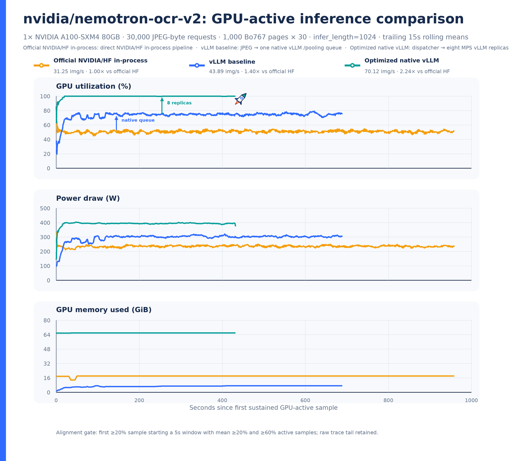
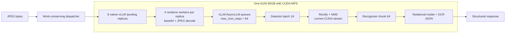

# Nemotron OCR v2 on vLLM

This repository contains a small vLLM pooling/plugin wrapper for
[nvidia/nemotron-ocr-v2](https://huggingface.co/nvidia/nemotron-ocr-v2).

The important caveat: Nemotron OCR v2 is not a native causal language model that
vLLM can load directly. The Hugging Face repository ships a Python OCR pipeline
with detector, recognizer, relational model, and custom CUDA extension. This
project registers a tiny vLLM pooling model plus an IO processor plugin; the
vLLM engine receives image paths, batches them as plugin prompts, and calls
`NemotronOCRV2` inside the vLLM worker.

vLLM does not make one OCR kernel intrinsically faster. The throughput gain
comes from native request queues, continuous batching, CPU/GPU overlap, and
enough concurrent replicas to fill pipeline gaps that are visible in a single
in-process call.

## Optimized source code and pull requests

The benchmarked implementation is split at the correct ownership boundary:

- **vLLM integration and serving path:**
  [`VibhuJawa/vllm#1`](https://github.com/VibhuJawa/vllm/pull/1), pinned at
  [`968f8c884`](https://github.com/VibhuJawa/vllm/commit/968f8c8849d9c10bb32f898107522d90f28fedce).
  This contains the native pooling model and I/O plugin, JPEG-byte ingestion,
  vLLM queue/sweep tooling, benchmark drivers, tests, and A100 report.
- **Nemotron OCR model and CUDA optimizations:**
  [`nvidia/nemotron-ocr-v2` PR #8](https://huggingface.co/nvidia/nemotron-ocr-v2/discussions/8),
  pinned at
  [`a92d75050`](https://huggingface.co/nvidia/nemotron-ocr-v2/commit/a92d75050f05c2638394e970bf8cec53c113d99b).
  This contains current-stream CUDA launches, reduced GPU synchronization,
  relational staging, fused OpenAI Triton decoding, and regression tests.
- **Results and telemetry:**
  [`results/a100-2026-07-09-final-85-imgs/`](results/a100-2026-07-09-final-85-imgs/README.md)
  is the immutable final matched bundle: official HF, tuned clean vLLM, and
  optimized native vLLM raw results/traces, repeated-control output agreement,
  exact and portable sweep configs, reusable harnesses, and final charts.
- **Earlier optimization checkpoint:**
  [`results/a100-2026-07-08/`](results/a100-2026-07-08/README.md) contains the
  earlier 70.12 images/s optimization progression, exact 1,000-page manifest,
  and historical charts.

Until both pull requests merge, use the pinned commits above rather than the
repositories' default branches. The final bundle also retains the exact
benchmark-time base commits, patch hashes, and source-state copies.

## Final matched A100 result: 85.3941303 images/s

The final 30,000-image comparison measured **31.2456869 images/s** for the
official NVIDIA/HF in-process pipeline, **45.1633991 images/s** for the tuned
clean-model single-queue vLLM baseline, and **85.3941303 images/s** for the
optimized eight-replica native-vLLM deployment. That is **2.733x** versus HF
and **1.891x** versus the corrected clean-vLLM baseline, with zero failed vLLM
requests.


[Full report, raw result JSON, GPU traces, provenance, output-agreement summary, and reusable sweep tooling](results/a100-2026-07-09-final-85-imgs/README.md)

This final bundle supersedes the 70.12 images/s historical checkpoint below for
the current headline. The older section remains as an optimization record.

### Model-patch-only Hugging Face A/B

The model PR now has its own isolated, repeated direct-HF measurement. Across
three matched 10K-image repetitions per condition, clean upstream reached
**31.0416 images/s** and PR #8 reached **31.6150 images/s**: a **1.847%**
model-only uplift. Every paired repetition was positive; the paired 95%
small-sample interval is **1.28% to 2.42%**.


[Full protocol, statistics, raw JSON/CSV telemetry, and vector chart](results/a100-2026-07-09-model-pr8-ab/README.md)

This is the speedup attributable to the earlier model-patch checkpoint under
direct HF execution. The historical 2.24x result below is a complete serving
stack result and is not attributed to the model PR alone.

## Historical A100 checkpoint: 70.12 images/s

The throughput-tuned native vLLM deployment reaches **70.12 images/s** on one
A100 80GB over 30,000 timed JPEG-byte requests at the default
`infer_length=1024`. The conservative recognizer-chunk profile reaches
**69.54 images/s**; see the accuracy note below.

| Metric | Optimized result |
| --- | ---: |
| Completed requests | 30,000 / 30,000 |
| Failed requests | 0 |
| Throughput profile (recognizer chunk 64) | **70.12 images/s** |
| Conservative profile (recognizer chunk 128) | **69.54 images/s** |
| Average / maximum GPU utilization | 99.74% / 100% |
| Average / maximum GPU power | 393.17 W / 446.51 W |
| Peak observed GPU memory | 67,555 MiB |

The clean official NVIDIA/Hugging Face in-process baseline reaches
**31.25 images/s**, the isolated single-replica native-vLLM baseline reaches
**43.89 images/s**, and optimized native vLLM reaches **70.12 images/s** on the
identical 30K JPEG workload. Optimized vLLM is therefore **2.24× faster than
official HF** and **1.60× faster than the clean vLLM baseline**. These are
measured local results, not model-card numbers.

### GPU-active comparison: official HF, clean vLLM, and optimized vLLM



[Vector chart](results/a100-2026-07-08/gpu_active_comparison.svg)

All three systems processed the same 30,000 JPEG-byte requests on the same A100,
with startup and warmup excluded. Lines are trailing 15-second rolling means,
aligned independently at the first sustained GPU-active sample. The figure
identifies the model, hardware, workload, and execution workflow directly.

| Metric | Official HF in-process | Clean vLLM baseline | Optimized native vLLM |
| --- | ---: | ---: | ---: |
| Throughput | 31.25 images/s (1.00×) | 43.89 images/s (1.40×) | **70.12 images/s (2.24×)** |
| Average GPU utilization | 50.75% | 73.69% | **99.74%** |
| Average GPU power | 235.14 W | 297.21 W | 393.17 W |
| Maximum GPU power | 425.29 W | 414.24 W | 446.51 W |
| Peak GPU memory | 18.09 GiB | 7.25 GiB | 65.97 GiB |

HF reaches 100% utilization during compute bursts but leaves gaps during
sequential decode, CPU postprocessing, and batch transitions. One native vLLM
queue closes part of that gap; the work-conserving eight-replica deployment
keeps the A100 almost continuously occupied.

[Raw HF result](results/a100-2026-07-08/hf-official-inprocess-b64-d32-30k.json)
· [Raw HF GPU trace](results/a100-2026-07-08/hf-official-inprocess-b64-d32-30k-gpu-trace.csv)
· [Raw clean-vLLM result](results/a100-2026-07-08/vllm-baseline-isolated-30k.json)
· [Raw clean-vLLM GPU trace](results/a100-2026-07-08/vllm-baseline-isolated-30k-gpu-trace.csv)

### Benchmark page corpus

The workload uses the **Digital Corpora Bo767** PDF collection used by NVIDIA's
[NeMo Retriever benchmark examples](https://docs.nvidia.com/nemo/retriever/latest/extraction/notebooks/).
The exact local source contains 767 numerically named PDFs. This should not be
confused with the separate SAFEDOCS `page1_png` pool used in the earlier L4
experiments.

The 1,000-page pool is deterministic: sort the 767 PDF filenames, render page 1
from every PDF, then render the first 233 available page-2 entries in the same
order. Pages were rendered at 144 DPI, encoded as JPEG quality 100 with 4:4:4
chroma sampling, and submitted as JPEG bytes. The sustained benchmark replays
that same ordered pool 30 times; it is **1,000 unique pages and 30,000 requests**,
not 30,000 unique documents.

[Exact 1,000-page manifest with source PDF/page and PNG/JPEG SHA-256 hashes](results/a100-2026-07-08/bo767-1k-page-manifest.csv)

### How the optimized path works



Key optimizations:

- Native vLLM `/pooling` requests carry JPEG bytes rather than filesystem paths.
- A work-conserving dispatcher gives the next image to whichever vLLM replica
  becomes available, avoiding fixed-shard tail imbalance.
- Eight long-lived replicas execute concurrently through CUDA MPS; vLLM keeps
  an independent continuous-batching queue inside each replica.
- Custom CUDA kernels launch on PyTorch's current stream, enabling correct
  overlap instead of implicitly serializing through the default stream.
- Detector batch 16, recognizer chunk 64, `max_num_seqs=64`, and four renderer
  workers were selected from measured sweeps.
- NMS/postprocessing synchronization and GPU-to-CPU transfers were reduced;
  probability extraction uses a fused **OpenAI Triton** GPU-kernel path (not
  NVIDIA Triton Inference Server).
- OCR payload serialization avoids per-byte Python lists, and request/access
  logging is disabled for the sustained serving configuration.
- `infer_length=1024` is retained, and experimental compilation paths that
  changed output equivalence were rejected. A controlled optimized-kernel check
  passed with zero text/region-count mismatches over 32 images. The rec64 versus
  rec128 batching comparison is not bitwise stable beyond the model's observed
  same-configuration nondeterminism, so rec128 at 69.54 img/s remains the
  conservative accuracy profile while rec64 is labeled the throughput profile.

[Raw optimized result](results/a100-2026-07-08/optimized-vllm-r8-rec64-30k.json)
· [Raw GPU trace](results/a100-2026-07-08/optimized-vllm-r8-rec64-30k-gpu-trace.csv)
· [Results summary](results/a100-2026-07-08/README.md)
· [Detailed report](results/a100-2026-07-08/DETAILED_REPORT.md)

## Repository Layout

- `src/nemotron_ocr_vllm/` registers the vLLM model and IO processor plugins.
- `model-config/config.json` is the minimal vLLM model config used by the wrapper.
- `run_vllm_ocr.py` runs OCR through the vLLM plugin path.
- `benchmarks/benchmark_ocr.py` compares direct Nemotron OCR with the vLLM wrapper.
- `notebooks/nemotron_ocr_vllm_demo.ipynb` is a runnable notebook version.
- `examples/make_sample_image.py` generates a small OCR sample image.
- `docs/design.md` explains why this uses vLLM's plugin API rather than the
  native VLM model path used by Nemotron Parse.

## Setup

Use Python 3.12 on a Linux machine with an NVIDIA GPU and a working CUDA toolkit.
Nemotron OCR builds a CUDA extension, so PyTorch's CUDA major version and the
available `nvcc` toolkit major version must match.

```bash
python3.12 -m venv .venv
source .venv/bin/activate
pip install --upgrade pip
pip install "vllm>=0.24.0"
```

Clone and install the NVIDIA OCR package:

```bash
git lfs install
git clone https://huggingface.co/nvidia/nemotron-ocr-v2
cd nemotron-ocr-v2/nemotron-ocr
pip install --no-build-isolation -v .
```

Then install this wrapper:

```bash
cd /path/to/nemotron-vllm-ocr
pip install -e ".[dev]"
```

If your Hugging Face cache points at a restricted location, set a writable cache:

```bash
export HF_HOME="$HOME/.cache/huggingface"
export HUGGINGFACE_HUB_CACHE="$HOME/.cache/huggingface/hub"
```

## Run

Generate a sample image:

```bash
python examples/make_sample_image.py
```

Run the vLLM-backed OCR path:

```bash
python run_vllm_ocr.py examples/sample_invoice.png
```

For scripts or notebooks, prefer writing JSON to a file so vLLM logs cannot
interleave with the payload:

```bash
python run_vllm_ocr.py examples/sample_invoice.png --output results/ocr.json
```

Run two images in one vLLM plugin call:

```bash
python run_vllm_ocr.py examples/sample_invoice.png examples/sample_invoice.png
```

## Benchmark

### A100 optimization progression

The current A100 optimization checkpoint, including raw summaries, a sustained
GPU trace, normalized provenance, and PNG/SVG charts, is available in
[`results/a100-2026-07-08/`](results/a100-2026-07-08/README.md).

Current measured highlights at the accuracy-preserving default
`infer_length=1024` are:

| Workload | Throughput | Notes |
| --- | ---: | --- |
| Offline vLLM, 1 replica | 15.28 images/s | 1,000 unique PNG document pages |
| Offline vLLM, 16 replicas | 63.76 images/s | 1,000 unique PNG document pages, 4.17× |
| Native vLLM `/pooling`, 1 replica | 44.72 images/s | 1,000 unique JPEG-byte pages |
| Native vLLM `/pooling`, 8 replicas | 65.49 images/s | 1,000 unique JPEG-byte pages |
| Official NVIDIA/HF in-process | 31.25 images/s | Matched 30K workload; 1K unique × 30 |
| Clean native-vLLM baseline | 43.89 images/s | Matched 30K workload; 1 replica; 1K unique × 30 |
| Native vLLM, 8 replicas, sustained | **70.12 images/s** | 30,000/30,000 requests; 1K unique × 30 |

The three 30K rows form the final matched headline comparison. The shorter
1K-unique and 512-image runs remain tuning/scaling evidence and are not mixed
into that speedup calculation.


[Vector version](results/a100-2026-07-08/deployment_optimization_curve.svg)

The benchmark measures initialization separately from loaded-engine inference.
For `--backend both`, it runs direct OCR and vLLM OCR in separate subprocesses so
GPU memory and module state do not leak between backends.

```bash
python benchmarks/benchmark_ocr.py \
  --backend both \
  --images examples/sample_invoice.png \
  --warmup 1 \
  --iterations 3 \
  --output results/benchmark-l4-single.json
```

For a small batch-like plugin call:

```bash
python benchmarks/benchmark_ocr.py \
  --backend both \
  --images examples/sample_invoice.png examples/sample_invoice.png examples/sample_invoice.png examples/sample_invoice.png \
  --warmup 1 \
  --iterations 3 \
  --output results/benchmark-l4-batch4.json
```

Interpretation guidelines:

- `texts_match=true` verifies the vLLM wrapper returns the same recognized text
  as direct Nemotron OCR for the benchmark images.
- `vllm_latency_over_direct` is expected to be above `1.0` for standalone OCR.
- Use direct `NemotronOCRV2` for the lowest local latency.
- Use this wrapper when the integration surface needs to be vLLM.

### Local Benchmark Results

These results were collected on an NVIDIA L4 with Python 3.12.13, Torch
2.11.0+cu130, and vLLM 0.24.0. See `results/benchmark-l4-single.json` and
`results/benchmark-l4-batch4.json` for the full payloads.

| Case | Direct Mean | vLLM Mean | Direct Throughput | vLLM Throughput | Texts Match | Region Counts Match |
| --- | ---: | ---: | ---: | ---: | --- | --- |
| 1 image | 0.1066 s | 0.1090 s | 9.38 img/s | 9.17 img/s | yes | yes |
| 4 images in one plugin call | 0.2548 s | 2.0716 s | 15.70 img/s | 1.93 img/s | yes | yes |

The single-image result shows the wrapper can preserve OCR behavior with little
loaded-call overhead for this sample. The four-image plugin result also preserves
OCR behavior, but shows high vLLM worker/scheduler variance for this adapter.
That reinforces the support boundary: this is a useful vLLM integration surface,
not a faster replacement for direct `NemotronOCRV2`.

## Notes

- The wrapper serializes OCR JSON into a `uint8` pooling tensor and decodes it in
  the IO processor. The default payload limit is 1 MiB.
- No model weights are redistributed here. Nemotron OCR v2 remains governed by
  NVIDIA's model terms and package requirements.
- vLLM may emit non-fatal warnings about optional CUDA kernels such as DeepGEMM
  depending on the local CUDA environment.
