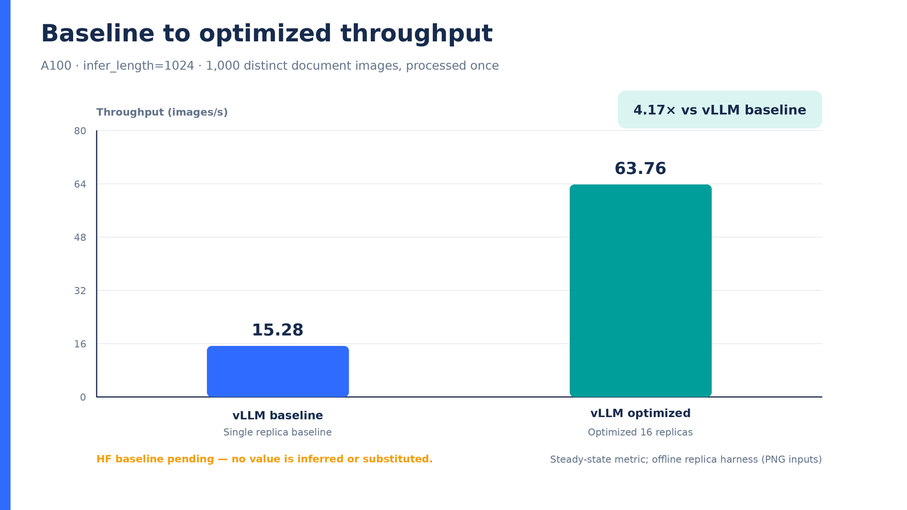
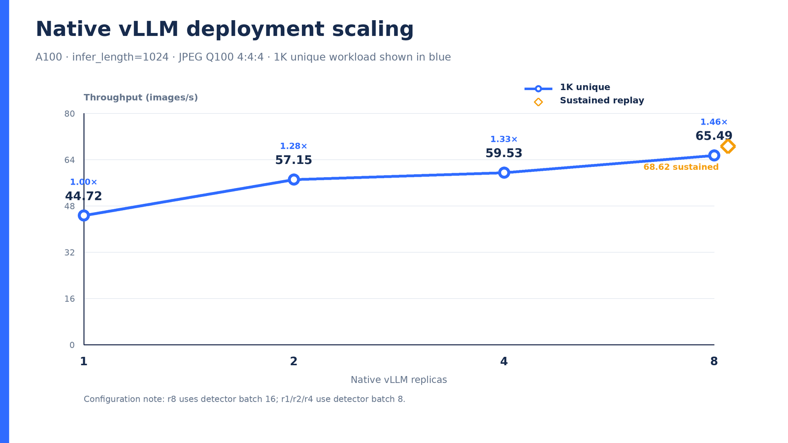
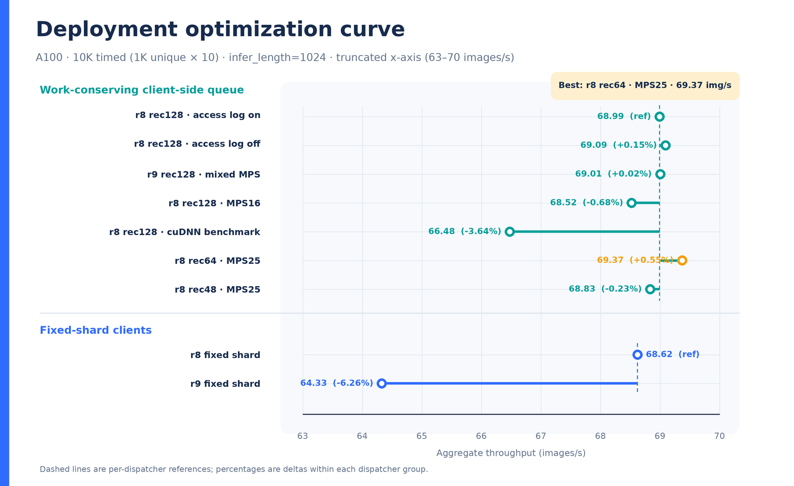
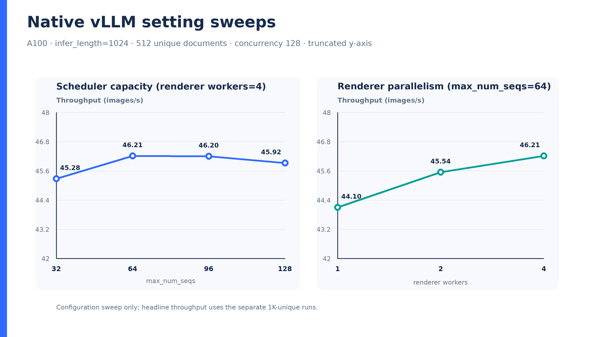
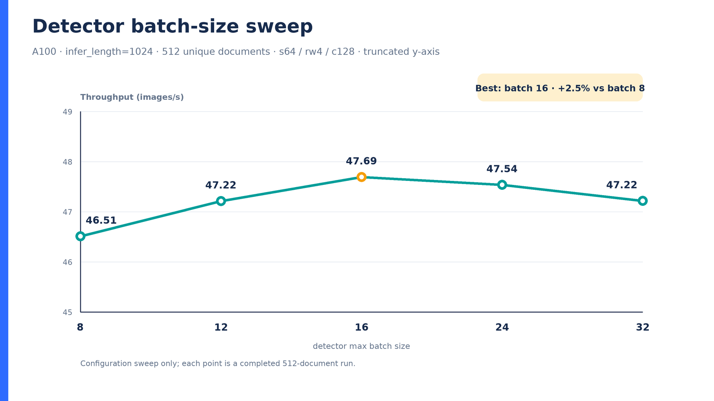

# Nemotron OCR v2 on A100: vLLM throughput

This report includes only `infer_length=1024` throughput artifacts. Headline results use 1,000 distinct document images exactly once; sustained replay is reported separately and never substituted for the 1K-unique result.

## Summary

- The offline vLLM replica harness rises from **15.28** to **63.76 images/s**, a **4.17×** steady-state speedup on the 1K-unique workload.
- Native vLLM serving scales from **44.72** at one replica to **65.49 images/s** at eight replicas (**1.46×**) on the separate 1K-unique JPEG workload.
- The 512-document settings sweeps peak at `max_num_seqs=64` (**46.21 images/s**), renderer workers=4 (**46.21 images/s**), and detector batch=16 (**47.69 images/s**).
- The matched 10K deployment sweep peaks at **69.37 images/s** with r8 rec64 · MPS25; dynamic and fixed-shard dispatchers are reported as separate groups.
- The completed 30K optimized publication run processed **30,000/30,000** images at **70.1156 images/s** with rec64; the conservative rec128 comparison measured **69.5380 images/s** (-0.82%).
- **Rec64 quality impact remains unresolved.** Rec64 is the throughput publication profile; conservative rec128 is retained as the accuracy profile until labeled evaluation isolates batching from run-to-run scheduling effects.
- **HF baseline pending.** No HF throughput value is inferred, copied from a different resolution, or otherwise fabricated. Add its result path to `configs/ocr_benchmark_report.json` (or pass `--hf-baseline-json`) after the 1024-resolution 1K-unique run completes.
- Sustained replay is **68.62 images/s** over 10,000 timed requests (1,000 unique images × 10 replays).
- **GPU-active comparison pending.** The generator will not draw the three-run chart until every measured result and raw trace is present.

## Baseline vs optimized



[Vector chart](baseline_vs_optimized.svg)

| Run | Throughput | Speedup vs baseline | Workload | Configuration |
|---|---:|---:|---|---|
| Single replica baseline | 15.28 images/s | 1.00× | 1K unique | 1 replica, s64, detector batch 8 |
| Optimized 16 replicas | 63.76 images/s | 4.17× | 1K unique | 16 replicas, s32, MPS 25%, queue chunk 32 |

These two values come from the offline replica harness and PNG inputs. They are directly comparable to each other, not to the native HTTP/JPEG serving series below.

## Native vLLM replica scaling



[Vector chart](native_vllm_scaling.svg)

| Replicas | Throughput | Speedup vs r1 | Workload | Detector batch |
|---:|---:|---:|---|---:|
| 1 | 44.72 images/s | 1.00× | 1K unique | 8 |
| 2 | 57.15 images/s | 1.28× | 1K unique | 8 |
| 4 | 59.53 images/s | 1.33× | 1K unique | 8 |
| 8 | 65.49 images/s | 1.46× | 1K unique | 16 |

The 8-replica point also changes detector batch from 8 to 16, so this is a deployment scaling curve rather than a strictly replica-only ablation.

## Deployment optimization curve (10K sustained)



[Vector chart](deployment_optimization_curve.svg)

Matched A100 native-vLLM runs over 1,000 JPEG Q100 4:4:4 document images repeated 10 times at infer_length=1024.

| Dispatcher | Configuration | Replicas | Rec chunk | MPS | Access log | cuDNN benchmark | Throughput | Δ vs group reference |
|---|---|---:|---:|---|---|---|---:|---:|
| Work-conserving client-side queue | r8 rec128 · access log on | 8 | 128 | 25% | on | off/default | 68.9906 images/s | reference |
| Work-conserving client-side queue | r8 rec128 · access log off | 8 | 128 | 25% | off | off/default | 69.0936 images/s | +0.15% |
| Work-conserving client-side queue | r9 rec128 · mixed MPS | 9 | 128 | mixed | not isolated | off/default | 69.0059 images/s | +0.02% |
| Work-conserving client-side queue | r8 rec128 · MPS16 | 8 | 128 | 16% | off | off/default | 68.5202 images/s | -0.68% |
| Work-conserving client-side queue | r8 rec128 · cuDNN benchmark | 8 | 128 | 25% | off | on | 66.4764 images/s | -3.64% |
| Work-conserving client-side queue | r8 rec64 · MPS25 | 8 | 64 | 25% | off | off/default | 69.3688 images/s | +0.55% |
| Work-conserving client-side queue | r8 rec48 · MPS25 | 8 | 48 | 25% | off | off/default | 68.8324 images/s | -0.23% |
| Fixed-shard clients | r8 fixed shard | 8 | 128 | 25% | not isolated | off/default | 68.6203 images/s | reference |
| Fixed-shard clients | r9 fixed shard | 9 | 128 | mixed | not isolated | off/default | 64.3263 images/s | -6.26% |

Dynamic work-conserving results and fixed-shard results use different dispatch policies. Their group-relative deltas are informative; treating the two groups as a controlled dispatcher-only ranking is not.

Some early dynamic summaries omitted explicit replay metadata. For r8 rec128 · access log on, r8 rec128 · access log off, r9 rec128 · mixed MPS, the curated manifest supplies the 1K × 10 run contract while the artifact itself must still report 1,000 unique images, 10,000 timed/completed images, zero failures, and the expected dispatcher.

## GPU-active aligned utilization and power

### 30K publication methodology template

Matched A100 publication runs over the same 1,000-image JPEG Q100 4:4:4 corpus, repeated 30 times (30,000 timed images) at infer_length=1024.

- **Hardware:** One NVIDIA A100 80GB; run systems sequentially with no overlapping GPU workload.
- **Workload:** The same ordered 1,000-image JPEG Q100 4:4:4 corpus repeated 30 times, for 30,000 timed images per system.
- **Quality Contract:** infer_length=1024 with the same model checkpoint and OCR post-processing contract.
- **Throughput Metric:** Completed timed images divided by the artifact's measured timed span; exclude engine startup and warmup.
- **Telemetry:** Raw nvidia-smi timestamp, utilization.gpu, and power.draw samples at a target 250 ms interval, captured around the complete timed run.
- **Acceptance control:** Record zero failed requests and exactly 30,000 completed images.
- **Acceptance control:** Record 1,000 unique images, replay_count=30, and timed_workload_image_count=30,000.
- **Acceptance control:** Keep dataset encoding, model revision, GPU identity/power limit, and infer_length fixed.
- **Acceptance control:** Retain result JSON and raw GPU CSV paths plus SHA-256 hashes in report_data.json.

### Completed optimized 30K profiles

Matched 30,000-image A100 runs using the same 1,000-image JPEG Q100 4:4:4 corpus repeated 30 times at infer_length=1024; only recognizer batching differs.

| Role | Rec chunk | Completed | Throughput | Δ vs rec64 | Avg GPU util | Avg power | Trace samples |
|---|---:|---:|---:|---:|---:|---:|---:|
| Throughput publication pair | 64 | 30,000/30,000 | 70.1156127 images/s | reference | 99.7445% | 393.1687 W | 1,726 |
| Conservative accuracy profile | 128 | 30,000/30,000 | 69.5380422 images/s | -0.824% | 99.6094% | 390.8946 W | 1,741 |

The rec64 run remains the throughput publication pair. Rec128 is retained as the conservative accuracy profile and is not added as a fourth system to the official-HF/vLLM-baseline/optimized telemetry chart. GPU utilization and power in this table are the averages recorded in each completed summary; the aligned chart reads the raw CSV samples. These profile labels separate deployment roles; they do not assert that rec64 preserves OCR quality.

| System | Result JSON | Raw GPU trace | Input state |
|---|---|---|---|
| Official NVIDIA/HF in-process | `TBD` | `TBD` | pending |
| vLLM baseline | `TBD` | `TBD` | pending |
| Optimized native vLLM | `publication_runs/optimized_vllm_r8_rec64_jpeg_q100_30k/summary.json` | `publication_runs/optimized_vllm_r8_rec64_jpeg_q100_30k/gpu_trace.csv` | ready |

### Aligned telemetry result

**Pending measured inputs; no chart or placeholder values are emitted.** Populate the following manifest fields after matched runs complete:

- Official NVIDIA/HF in-process: result_path, trace_path
- vLLM baseline: result_path, trace_path

Manifest comparison contract: Matched A100 publication runs over the same 1,000-image JPEG Q100 4:4:4 corpus, repeated 30 times (30,000 timed images) at infer_length=1024.

Alignment and smoothing algorithm:

1. Parse timestamp, `utilization.gpu [%]`, and `power.draw [W]` directly from each raw `nvidia-smi` CSV; invalid metric rows are excluded.
2. Scan forward for the earliest sample at or above 20% whose next 5s window has mean GPU utilization at least 20% and at least 60% of samples at or above 20%.
3. Discard only samples before that point and independently set each run's detected point to `t=0`; retain the raw trace tail so workload completion remains visible.
4. Plot a sample-based trailing 15s arithmetic mean for both GPU utilization and power draw. The window is configurable with `--gpu-rolling-window-seconds`.

The chart is gated on all three runs sharing the same completed count, `infer_length`, workload kind, unique-image count, and replay count.

## Setting sweeps



[Vector chart](native_settings_sweep.svg)

| Sweep | Setting | Throughput |
|---|---:|---:|
| max_num_seqs (rw4) | 32 | 45.28 images/s |
| max_num_seqs (rw4) | 64 | 46.21 images/s |
| max_num_seqs (rw4) | 96 | 46.20 images/s |
| max_num_seqs (rw4) | 128 | 45.92 images/s |
| renderer workers (s64) | 1 | 44.10 images/s |
| renderer workers (s64) | 2 | 45.54 images/s |
| renderer workers (s64) | 4 | 46.21 images/s |



[Vector chart](detector_batch_sweep.svg)

| Detector batch | Throughput |
|---:|---:|
| 8 | 46.51 images/s |
| 12 | 47.22 images/s |
| 16 | 47.69 images/s |
| 24 | 47.54 images/s |
| 32 | 47.22 images/s |

Both settings charts use 512 distinct documents and a deliberately truncated y-axis to make small tuning differences visible. They are ablations, not the 1K-unique headline.

## Output agreement and workload gates

- The controlled optimized Triton comparison **passed**: 0 region-count mismatches, 0 text mismatches, 100.0% text exact rate across 32 images. This validates that specific controlled kernel-path check; it does not establish rec64 batching quality.
- A repeated baseline run itself **did not pass** the strict bitwise-style comparison (2 region-count mismatches; 93.5% text exact). This documents run-to-run nondeterminism. `infer_length=1024` is a configuration eligibility rule for this report, not evidence that an optimization preserves OCR accuracy.

### Batching and nondeterminism diagnostics

| Comparison | Type | Strict pass | Region-count mismatches | Text mismatches / paired | Text exact |
|---|---|---|---:|---:|---:|
| PNG baseline vs same-config repeat | same-config repeat | no | 2 | 50 / 764 | 93.455% |
| JPEG rec128 vs same-config repeat | same-config repeat | no | 1 | 26 / 743 | 96.501% |
| JPEG rec128 vs rec64 | rec128/rec64 batching | no | 1 | 43 / 743 | 94.213% |
| JPEG rec128 repeat vs rec64 | rec128/rec64 batching | no | 2 | 49 / 743 | 93.405% |

This mismatch table is retained as nondeterminism documentation. Raw paired-region coordinate and confidence maxima are intentionally not used as quality evidence: insertions/deletions shift region sequences and can make subsequent positional pairings incomparable.

### Sequence-aware JPEG diagnostics

Profiles: **A** = rec128 reference, **B** = rec128 repeat, **C** = rec64.

| Pair | Page-text sequence Levenshtein total | Exact page sequences |
|---|---:|---:|
| A-B: rec128 reference vs rec128 repeat | 16 | 22/32 |
| A-C: rec128 reference vs rec64 | 21 | 18/32 |
| B-C: rec128 repeat vs rec64 | 16 | 21/32 |

Position-wise agreement covers 629 regions on 30/32 pages where all three runs emitted the same region count:

| Agreement category | Regions | Share of aligned regions |
|---|---:|---:|
| A = B = C | 611 | 97.138% |
| A = B ≠ C | 7 | 1.113% |
| B = C ≠ A | 7 | 1.113% |
| A = C ≠ B | 3 | 0.477% |
| A, B, C all different | 1 | 0.159% |

Method: Levenshtein distance over each page's ordered region-text sequence; triple agreement is position-wise only on pages where A, B, and C have equal region counts.

**Conclusion: rec64 quality impact is unresolved; conservative rec128 is retained as the accuracy profile.** There are no labeled reference transcriptions or boxes, so agreement is not ground-truth accuracy. In addition, work-conserving scheduling can place a page at different dynamic batch positions across runs, confounding recognizer chunk size with ordinary run-to-run variation. The diagnostics therefore establish neither bitwise identity nor accuracy preservation.

Workload labels are enforced from artifact counts and the curated source manifest:

- **1K unique:** 1,000 distinct page images, processed once.
- **512 unique:** 512 distinct page images, processed once, used only for tuning sweeps.
- **Sustained replay:** requires `replay_count > 1` and timed request count greater than the unique-image count.

## Methodology and provenance

- Hardware: NVIDIA A100 80GB.
- Resolution contract: `infer_length=1024`; no 768 results are ingested.
- Offline input: PNG source pages.
- Native serving input: JPEG quality 100, 4:4:4.
- Throughput values are read directly from the listed JSON/CSV artifacts.
- Full normalized data and SHA-256 provenance are in `report_data.json`.

| Use | Source artifact | SHA-256 (first 12) |
|---|---|---|
| Offline baseline | `a100_replica_sweeps/accuracy_baseline_1024/sweep_summary.json` | `293ba2ef6874` |
| Offline optimized | `a100_replica_sweeps/accuracy_optimized2_1024_mps_inproc_pct25_r16_q32_s32/sweep_summary.json` | `4cb686027ff4` |
| Native r1 | `native_vllm/native_single_s64_c128_jpeg_q100_444_1k.json` | `f3c030f2e03c` |
| Native r2 | `native_vllm_replicas/r2_s64_rw4_c128_mps50_jpeg_q100_1k/summary.json` | `6dbd4cac707f` |
| Native r4 | `native_vllm_replicas/r4_s64_rw4_c128_mps25_jpeg_q100_1k/summary.json` | `f6c852e66026` |
| Native r8 | `native_vllm_replicas/r8_s64_rw4_c128_det16_mps25_jpeg_q100_1k/summary.json` | `c328b3cb3533` |
| Sustained replay | `native_vllm_replicas/r8_s64_rw4_c128_det16_mps25_orjson_jpeg_q100_replay10/summary.json` | `2ab679589b5e` |
| Deployment: r8 rec128 · access log on | `native_vllm_replicas/r8_s64_rw4_c128_det16_mps25_jpeg_q100_dynamic10k/summary.json` | `1aaa96c114c3` |
| Deployment: r8 rec128 · access log off | `native_vllm_replicas/r8_s64_rw4_c128_det16_mps25_noaccesslog_jpeg_q100_dynamic10k/summary.json` | `b142ba4099e4` |
| Deployment: r9 rec128 · mixed MPS | `native_vllm_replicas/r9_s64_rw4_c128_det16_mps_mixed_jpeg_q100_dynamic10k/summary.json` | `8744c40337a7` |
| Deployment: r8 rec128 · MPS16 | `native_vllm_replicas/r8_s64_rw4_c128_det16_mps16_noaccesslog_jpeg_q100_dynamic10k/summary.json` | `603589df03ab` |
| Deployment: r8 rec128 · cuDNN benchmark | `native_vllm_replicas/r8_s64_rw4_c128_det16_mps25_cudnnbenchmark_noaccesslog_jpeg_q100_dynamic10k/summary.json` | `45be88e2ca05` |
| Deployment: r8 rec64 · MPS25 | `native_vllm_replicas/r8_s64_rw4_c128_det16_rec64_mps25_noaccesslog_jpeg_q100_dynamic10k/summary.json` | `0bd490e603c5` |
| Deployment: r8 rec48 · MPS25 | `native_vllm_replicas/r8_s64_rw4_c128_det16_rec48_mps25_noaccesslog_jpeg_q100_dynamic10k/summary.json` | `c921873faef9` |
| Deployment: r8 fixed shard | `native_vllm_replicas/r8_s64_rw4_c128_det16_mps25_orjson_jpeg_q100_replay10/summary.json` | `2ab679589b5e` |
| Deployment: r9 fixed shard | `native_vllm_replicas/r9_s64_rw4_c128_det16_mps_mixed_jpeg_q100_replay10/summary.json` | `c3215f45b52e` |
| 30K Throughput publication pair result | `publication_runs/optimized_vllm_r8_rec64_jpeg_q100_30k/summary.json` | `a77abaa9afb2` |
| 30K Throughput publication pair trace | `publication_runs/optimized_vllm_r8_rec64_jpeg_q100_30k/gpu_trace.csv` | `b6ca419d6ec1` |
| 30K Conservative accuracy profile result | `publication_runs/optimized_vllm_r8_rec128_jpeg_q100_30k/summary.json` | `5796c1f749a5` |
| 30K Conservative accuracy profile trace | `publication_runs/optimized_vllm_r8_rec128_jpeg_q100_30k/gpu_trace.csv` | `396e8b8722d7` |
| Settings sweep | `native_vllm_sweeps/native_jpeg_q100_targeted_20260708/summary.csv` | `bc2c62a7634f` |
| Detector sweep | `native_vllm_sweeps/native_detector_jpeg_q100_20260708/summary.csv` | `ba8fc77590b6` |
| Optimized Triton path vs repeated baseline | `equivalence_optimized_triton_1024_32_comparison.json` | `a7e52556f73c` |
| Repeated baseline vs baseline | `equivalence_baseline_repeat_1024_32_comparison.json` | `7c34bc3e291a` |
| Nondeterminism: PNG baseline vs same-config repeat | `equivalence_baseline_repeat_1024_32_comparison.json` | `7c34bc3e291a` |
| Nondeterminism: JPEG rec128 vs same-config repeat | `jpeg_equivalence/rec128_repeat_comparison.json` | `a5aeefcfc727` |
| Nondeterminism: JPEG rec128 vs rec64 | `jpeg_equivalence/rec128_vs_rec64_comparison.json` | `9f451cf78d6a` |
| Nondeterminism: JPEG rec128 repeat vs rec64 | `jpeg_equivalence/rec128_repeat_vs_rec64_comparison.json` | `d93dc28d37c1` |
| Sequence audit A: rec128 reference | `jpeg_equivalence/vllm_optimized_predictions.json` | `50ef2508e2a8` |
| Sequence audit B: rec128 repeat | `jpeg_equivalence/vllm_optimized_rec128_repeat_predictions.json` | `a46d668c9a06` |
| Sequence audit C: rec64 | `jpeg_equivalence/vllm_optimized_rec64_predictions.json` | `f6edbb4308ad` |

## Reproduce

```bash
/raid/vjawa/tmp/ocr_optimization/venv/bin/python \
  /home/nfs/vjawa/ocr_optimization/scripts/generate_ocr_benchmark_report.py \
  --strict --gpu-rolling-window-seconds 15
```

The output is deterministic for a fixed manifest and source artifacts. PNG and SVG charts are produced from the same geometry.
