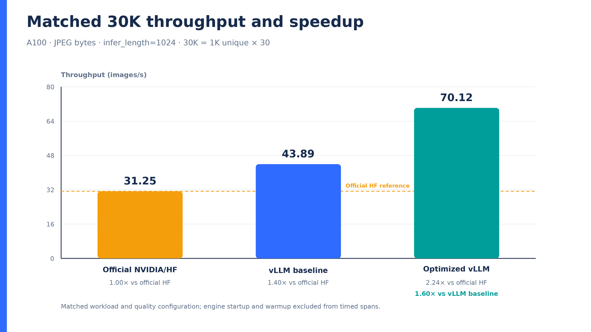

# Nemotron OCR v2: matched A100 benchmark

This directory contains the final matched 30,000-request comparison for
`nvidia/nemotron-ocr-v2` on one NVIDIA A100-SXM4 80GB. Every system used
`infer_length=1024`, the same ordered JPEG-byte page pool, 30 warm replays, and
zero failed timed requests. Model/server startup and warmup are excluded from
throughput.

## Result

| System | Throughput | Speedup vs HF | Speedup vs clean vLLM |
|---|---:|---:|---:|
| Official NVIDIA/HF in-process | 31.2457 images/s | 1.00× | 0.71× |
| Clean native-vLLM baseline | 43.8927 images/s | 1.40× | 1.00× |
| Optimized native vLLM | **70.1156 images/s** | **2.24×** | **1.60×** |

[Vector throughput chart](matched_30k_speedup.svg)

## GPU-active utilization, power, and memory

[Vector telemetry chart](gpu_active_comparison.svg)

The curves are aligned independently at the first sustained GPU-active sample
and use trailing 15-second rolling means. The raw trace tail is retained, so
curve length also shows the time each system required to finish the same work.

| Metric | Official HF | Clean vLLM | Optimized vLLM |
|---|---:|---:|---:|
| Throughput | 31.25 img/s | 43.89 img/s | **70.12 img/s** |
| Average GPU utilization | 50.75% | 73.69% | **99.74%** |
| Average GPU power | 235.14 W | 297.21 W | 393.17 W |
| Maximum GPU power | 425.29 W | 414.24 W | 446.51 W |
| Peak GPU memory | 18.09 GiB | 7.25 GiB | 65.97 GiB |

## Exact page corpus

The matched run used the local **Digital Corpora Bo767** collection referenced
by NVIDIA's
[NeMo Retriever benchmark examples](https://docs.nvidia.com/nemo/retriever/latest/extraction/notebooks/).
It did not use the older L4 thread's separate `safedocs/page1_png` directory.

The source directory contains 767 PDFs. The deterministic 1,000-page pool is:

1. Page 1 from all 767 PDFs, sorted by numeric filename.
2. The first 233 available page-2 entries in that same order.
3. PDFium rendering at 144 DPI.
4. JPEG quality 100, 4:4:4 chroma sampling, submitted as JPEG bytes.

The timed 30K workload repeats this same ordered pool 30 times. It therefore
contains **1,000 unique document pages**, not 1,000 unique PDFs or 30,000 unique
documents.

- Input artifact: `bo767_1k_pooling_jpeg_q100_444.jsonl`
- Input SHA-256: `139c96ef75a85da440350722a95d9eb3bd21dd4155d43f7281253f63c07eaa16`
- Verification: all 1,000 decoded JSONL JPEGs matched the ordered render set in
  dimensions; mean PNG-to-JPEG PSNR was 62.50 dB.
- [Exact source-PDF/page and PNG/JPEG hash manifest](bo767-1k-page-manifest.csv)

## Execution paths

- **Official HF:** direct `NemotronOCRV2` in-process pipeline, batch 64,
  detector batch 32.
- **Clean vLLM:** one native `/pooling` server and one vLLM scheduling queue,
  `max_num_seqs=64`, detector batch 8, recognizer chunk 128.
- **Optimized vLLM:** work-conserving dispatch across eight native `/pooling`
  replicas under CUDA MPS; each replica retains its own vLLM queue and
  continuous batching. Detector batch 16, recognizer chunk 64,
  `max_num_seqs=64`, and four renderer workers per replica.

The optimized path also launches custom CUDA kernels on PyTorch's current
stream, reduces postprocessing synchronization and device-to-host traffic, uses
a fused **OpenAI Triton** GPU kernel for probability extraction, transports
native JPEG bytes, and disables sustained-run request logging. “OpenAI Triton”
does not refer to NVIDIA Triton Inference Server.

## Raw artifacts

- [Official HF result](hf-official-inprocess-b64-d32-30k.json) and
  [GPU trace](hf-official-inprocess-b64-d32-30k-gpu-trace.csv)
- [Clean vLLM result](vllm-baseline-isolated-30k.json) and
  [GPU trace](vllm-baseline-isolated-30k-gpu-trace.csv)
- [Optimized vLLM result](optimized-vllm-r8-rec64-30k.json) and
  [GPU trace](optimized-vllm-r8-rec64-30k-gpu-trace.csv)
- [Conservative rec128 control](optimized-vllm-r8-rec128-control-30k.json)
- [Normalized report data with source hashes](report_data.json)
- [Full benchmark methodology, sweeps, and quality caveats](DETAILED_REPORT.md)

The rec64 result is labeled the throughput profile. Rec128 reached 69.5380
images/s and remains the conservative accuracy profile because the available
unlabeled agreement checks cannot separate recognizer batching effects from
the model's observed run-to-run nondeterminism.
