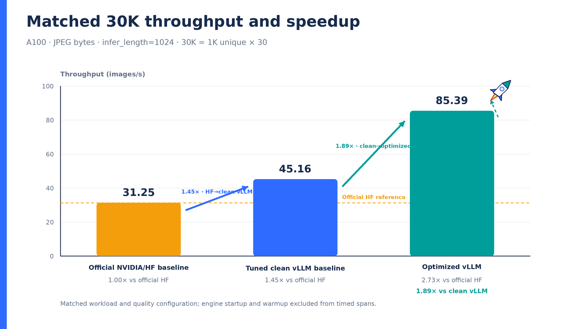
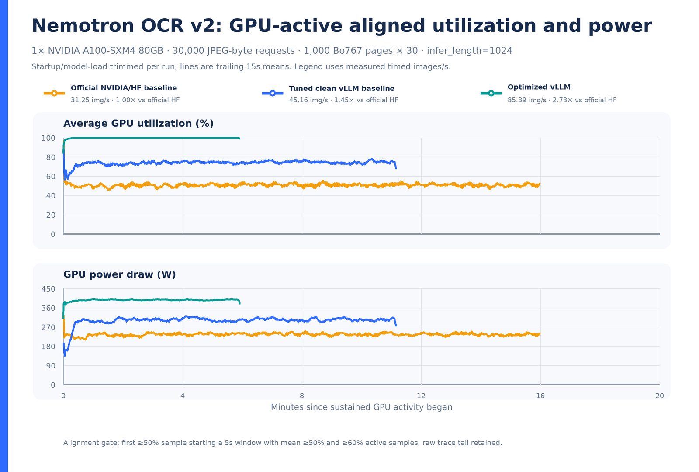

# Final matched A100 result: 85.3941303 images/s

This immutable bundle records the final July 9, 2026 matched comparison on one
NVIDIA A100-SXM4-80GB. All three systems processed the same ordered 1,000-page
JPEG Q100 4:4:4 corpus 30 times: 30,000 timed images at `infer_length=1024`.
Startup/model load and warmup are outside timed throughput.

| System | Execution workflow | Throughput | Relative to HF | Timed result |
| --- | --- | ---: | ---: | --- |
| Official NVIDIA/HF | Direct in-process pipeline | **31.2456869 images/s** | 1.000x | [`result.json`](runs/hf-official/result.json) |
| Tuned clean vLLM | One native `/pooling` queue | **45.1633991 images/s** | 1.445x | [`summary.json`](runs/clean-vllm/summary.json) |
| Optimized native vLLM | Dispatcher to eight MPS `/pooling` replicas | **85.3941303 images/s** | **2.733x** | [`summary.json`](runs/optimized-vllm/summary.json) |

Optimized native vLLM is 1.891x the corrected clean-vLLM baseline. Both vLLM
runs completed 30,000/30,000 requests with zero reported failures. The HF
artifact records the complete 30,000-image timed workload but has no separate
failed-request field.





The complete narrative, active-window telemetry method, tables, and vector
chart links are in [`comparison/NEMOTRON_OCR_COMPARISON.md`](comparison/NEMOTRON_OCR_COMPARISON.md).
The chart generator's selected data, including aligned time series, is retained
in [`comparison/report_data.json`](comparison/report_data.json).

The exact chart/report generator and its focused test are bundled as
[`scripts/generate_ocr_benchmark_report.py`](scripts/generate_ocr_benchmark_report.py)
and [`tests/test_generate_ocr_benchmark_report.py`](tests/test_generate_ocr_benchmark_report.py).
From this bundle directory, regenerate the comparison without rerunning models:

```bash
python scripts/generate_ocr_benchmark_report.py \
  --comparison-only \
  --output-dir /tmp/nemotron-ocr-final-comparison \
  --official-hf-result-json comparison/reproduction-inputs/hf-result.json \
  --official-hf-trace-csv runs/hf-official/gpu_trace.csv \
  --tuned-clean-vllm-result-json comparison/reproduction-inputs/clean-vllm-summary.json \
  --tuned-clean-vllm-trace-csv runs/clean-vllm/gpu_trace.csv \
  --optimized-vllm-result-json comparison/reproduction-inputs/optimized-vllm-summary.json \
  --optimized-vllm-trace-csv runs/optimized-vllm/gpu_trace.csv
```

The portable inputs change only each raw result's recorded trace path; all
metrics remain identical. Their derivation and raw-source hashes are documented
in [`comparison/reproduction-inputs/README.md`](comparison/reproduction-inputs/README.md).

## Workload and execution contract

- GPU: one NVIDIA A100-SXM4-80GB; driver `580.95.05`.
- Input: JPEG bytes represented as base64 data URIs in the JSONL benchmark
  transport. Base64 and JPEG decode are part of the timed pipeline.
- Corpus: 1,000 deterministic Bo767 document pages, SHA-256
  `139c96ef75a85da440350722a95d9eb3bd21dd4155d43f7281253f63c07eaa16`.
- Timed workload: 1,000 unique pages x 30 ordered replays = 30,000 images.
- Inference: `infer_length=1024`, detector batch 16 for vLLM, recognizer and
  relational chunks 128. The direct HF run used detector batch 32 and outer
  batch 64.
- Clean vLLM: one replica, `max_num_seqs=64`, four renderer workers, client
  concurrency 128, no MPS.
- Optimized vLLM: eight replicas under CUDA MPS at 25% active-thread allocation
  per process, `max_num_seqs=40`, four renderer workers per replica, client
  concurrency 64 per endpoint, work-conserving dispatch, eager execution.

The optimized result uses independent native vLLM queues in long-lived replicas.
CUDA MPS and current-stream custom kernels let those queues overlap pipeline
gaps while vLLM schedules each replica's `/pooling` work.

## Raw artifacts

| System | Result | GPU trace | Run metadata |
| --- | --- | --- | --- |
| Official HF | [`result.json`](runs/hf-official/result.json) | [`gpu_trace.csv`](runs/hf-official/gpu_trace.csv) | Embedded in result |
| Clean vLLM | [`summary.json`](runs/clean-vllm/summary.json) | [`gpu_trace.csv`](runs/clean-vllm/gpu_trace.csv) | [`run_summary.json`](runs/clean-vllm/run_summary.json), [`provenance.json`](runs/clean-vllm/provenance.json) |
| Optimized vLLM | [`summary.json`](runs/optimized-vllm/summary.json) | [`gpu_trace.csv`](runs/optimized-vllm/gpu_trace.csv) | [`run_summary.json`](runs/optimized-vllm/run_summary.json), [`provenance.json`](runs/optimized-vllm/provenance.json) |

The provenance captures repository commits and dirty state, source-patch hashes,
extension hashes, exact command lines, server environments, the target GPU, and
dataset identity. [`SHA256SUMS`](SHA256SUMS) covers every bundled artifact other
than the checksum file itself.

Because the optimized run was captured from dirty source trees, the referenced
tracked patches and untracked files are also copied under
[`runs/optimized-vllm/source_state/`](runs/optimized-vllm/source_state/). This
makes the provenance's source hashes resolvable without relying on the mutable
lab paths recorded in the original JSON.

## Output-agreement scope

[`accuracy/output_agreement_summary.json`](accuracy/output_agreement_summary.json)
is a compact extraction of the repeated-control, 1,000-page full-exact fusion
comparison. Its repeat-calibrated classification is
`no_output_regression_detected`. It is an output-agreement measurement against
repeated controls, not labeled-ground-truth OCR accuracy. The strict pairwise
equality flag is false and is intentionally retained; see
[`accuracy/README.md`](accuracy/README.md) for the interpretation and source
hashes.

The 68K-line full envelope and four multi-megabyte prediction captures are not
duplicated here. Their SHA-256 hashes are retained in the compact summary.

## Reproducing and sweeping vLLM settings

The exact benchmark-time files are preserved byte-for-byte:

- [`scripts/run_native_vllm_sweep.py`](scripts/run_native_vllm_sweep.py) starts
  replicas, manages CUDA MPS, verifies source/dataset pins, waits for readiness,
  invokes the client, captures provenance, and cleans up processes.
- [`scripts/benchmark_multi_endpoint_pooling.py`](scripts/benchmark_multi_endpoint_pooling.py)
  drives a work-conserving queue across native vLLM `/pooling` endpoints and
  records GPU telemetry.
- [`tests/test_run_native_vllm_sweep.py`](tests/test_run_native_vllm_sweep.py)
  exercises config validation, GPU ownership, MPS percentages, exact source
  checks, and command construction without requiring a GPU run.
- [`scripts/generate_ocr_benchmark_report.py`](scripts/generate_ocr_benchmark_report.py)
  deterministically rebuilds the PNG/SVG comparison from the checked-in JSON
  and CSV inputs; [`tests/test_generate_ocr_benchmark_report.py`](tests/test_generate_ocr_benchmark_report.py)
  checks explicit source selection and chart semantics.
- [`scripts/NATIVE_VLLM_SWEEP.md`](scripts/NATIVE_VLLM_SWEEP.md) and
  [`scripts/CLEAN_VLLM_BASELINE_SWEEP.md`](scripts/CLEAN_VLLM_BASELINE_SWEEP.md)
  document launcher behavior and safety constraints.

Host-specific exact configs live under [`configs/exact/`](configs/exact/).
Editable single-run equivalents live under [`configs/portable/`](configs/portable/).
Replace the explicit `/path/to/...` and GPU UUID placeholders before running;
see [`configs/README.md`](configs/README.md).

The clean-baseline search is preserved under
[`sweeps/clean-baseline/`](sweeps/clean-baseline/), including the original 10K
sweep summaries, the 30K winner validation, and a compact sorted
[`ranking.json`](sweeps/clean-baseline/ranking.json).
