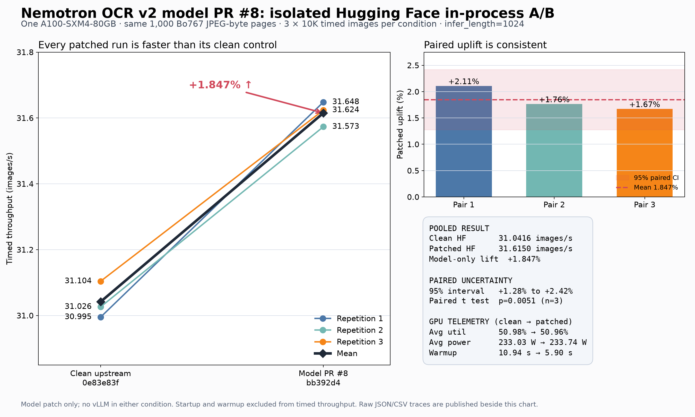

# Nemotron OCR v2 model PR #8: isolated Hugging Face A/B

The model-source changes in
[`nvidia/nemotron-ocr-v2` PR #8](https://huggingface.co/nvidia/nemotron-ocr-v2/discussions/8)
raise direct Hugging Face in-process throughput from **31.0416 to 31.6150
images/s** on the matched A100 workload: a **1.847% model-only uplift**.

Every patched repetition beat its clean control. The three paired uplifts were
**2.11%, 1.76%, and 1.67%**. Their paired mean is 1.847%, with a small-sample
95% Student-t interval of **1.28% to 2.42%** (`n=3`, two-sided paired
`p=0.0051`). The interval should still be treated cautiously because it is
based on only three timing repetitions.

[Vector chart](model_pr8_hf_ab.svg) · [Normalized summary](summary.json) ·
[Plot and aggregation source](plot_model_pr8_ab.py)

## Throughput result

| Repetition | Clean upstream | Model PR #8 | Paired uplift |
| --- | ---: | ---: | ---: |
| 1 | 30.9950 images/s | 31.6482 images/s | +2.107% |
| 2 | 31.0261 images/s | 31.5733 images/s | +1.764% |
| 3 | 31.1040 images/s | 31.6237 images/s | +1.671% |
| **Pooled 30K/condition** | **31.0416 images/s** | **31.6150 images/s** | **+1.847%** |

Each condition processed 30,000 timed images in total, split into three
independent 10,000-image repetitions so that run-to-run variance could be
measured. Startup and warmup are excluded from timed throughput.

This is the correct number to attribute to the model patch in direct
Hugging Face execution. The larger **2.24x** optimized-vLLM-versus-HF result is
an end-to-end serving result and must not be attributed to this model PR alone.

## GPU telemetry

| Timed metric | Clean upstream | Model PR #8 |
| --- | ---: | ---: |
| Weighted average GPU utilization | 50.975% | 50.956% |
| Weighted average GPU power | 233.03 W | 233.74 W |
| Maximum GPU power | 419.95 W | 420.88 W |
| Peak observed `nvidia-smi` memory | 22,875 MiB | 20,081 MiB |
| Maximum PyTorch allocated memory | 17.315 GB | 18.389 GB |
| Mean 128-image warmup | 10.94 s | 5.90 s |

Average utilization and power are essentially unchanged. The patch shortens
the work needed for the same image count rather than increasing the
single-process duty cycle. Its current-stream and synchronization changes are
also prerequisites for the much larger concurrency gains measured with
multiple vLLM queues.

The two memory rows use different instruments and should not be conflated:
`nvidia-smi` observes total process/device residency, while the PyTorch number
tracks allocator-owned tensor memory.

## Matched test contract

| Control | Recorded value |
| --- | --- |
| Hardware | One NVIDIA A100-SXM4-80GB, UUID `GPU-cff1bde8-b1d6-39fb-5345-7be496ca6448` |
| Backend | Direct `NemotronOCRV2`; no vLLM in either condition |
| Clean model | `0e83e83f17943524b90afa6c0fd82ac2bc1a40ca` |
| Patched model | `bb392d494b616d3a1692c3dbe59f63c1d2a8a7fa` |
| Corpus | Same ordered 1,000 Digital Corpora Bo767 document pages |
| Encoding | JPEG quality 100, 4:4:4, carried as base64 JPEG bytes in JSONL |
| Per repetition | 1,000 unique pages × 10 replays = 10,000 timed images |
| Repetitions | Three per condition; 30,000 timed images per condition |
| OCR settings | Paragraph merge, `infer_length=1024`, detector 32, recognizer 128, relational 128 |
| Batch and warmup | Batch 64; 128 warmup images per repetition |
| Telemetry | `nvidia-smi` at a target 250 ms interval |
| Isolation | Six sequential runs; no overlapping GPU workload |
| Execution order | clean 1, patched 1, patched 2, clean 2, clean 3, patched 3 |

The input is `bo767_1k_pooling_jpeg_q100_444.jsonl`, SHA-256
`139c96ef75a85da440350722a95d9eb3bd21dd4155d43f7281253f63c07eaa16`.
Base64 and JPEG decoding occur inside the timed pipeline.

This A/B used a different physical A100 from the earlier full-deployment
study. Absolute throughput should therefore be compared within this A/B; the
paired percentage is the portable result.

## Raw artifacts

| Condition | Result JSON | GPU trace |
| --- | --- | --- |
| Clean 1 | [baseline-r1.json](baseline-r1.json) | [CSV](baseline-r1-gpu-trace.csv) |
| Clean 2 | [baseline-r2.json](baseline-r2.json) | [CSV](baseline-r2-gpu-trace.csv) |
| Clean 3 | [baseline-r3.json](baseline-r3.json) | [CSV](baseline-r3-gpu-trace.csv) |
| Patched 1 | [patched-r1.json](patched-r1.json) | [CSV](patched-r1-gpu-trace.csv) |
| Patched 2 | [patched-r2.json](patched-r2.json) | [CSV](patched-r2-gpu-trace.csv) |
| Patched 3 | [patched-r3.json](patched-r3.json) | [CSV](patched-r3-gpu-trace.csv) |

The exact baseline and patched CUDA-extension binaries are pinned in
[`summary.json`](summary.json) by SHA-256. The patched binary was rebuilt
earlier from the exact committed C++ sources for `sm_80`; the repackaging host
used for this A/B lacked Python development headers, so that verified binary
was copied into the detached clean PR worktree rather than rebuilt again.

## Interpretation

The result supports a narrow claim: **PR #8 improves direct HF in-process
throughput by about 1.85% on this workload.** It does not, by itself, explain
the 2.24x end-to-end serving result. Most of that larger gain comes from native
vLLM queuing, continuous batching, work-conserving dispatch, and eight warmed
replicas filling the pipeline gaps that remain visible in a single HF process.

The benchmark measures performance rather than OCR quality. A separate
32-image controlled comparison recorded zero text or region-count mismatches,
but a labeled accuracy evaluation remains necessary before making a broader
quality claim.
